# 1-Stop Book Project - Architecture Diagrams

## Table of Contents

1. [Overview](#overview)
2. [High-Level Architecture](#high-level-architecture)
   - [Interaction Overview Diagram](#interaction-overview-diagram)
   - [Use Case Diagram](#use-case-diagram)
   - [System Context Diagram](#system-context-diagram)
   - [Logical Architecture Overview](#logical-architecture-overview)
3. [Detailed Architecture](#detailed-architecture)
   - [Microservices Architecture](#microservices-architecture)
   - [Detailed Booking Sequence Diagram](#detailed-booking-sequence-diagram)
   - [Component Architecture](#component-architecture)
4. [Infrastructure & Deployment](#infrastructure--deployment)
   - [Deployment Architecture](#deployment-architecture)
   - [Security Architecture](#security-architecture)
5. [Architecture Decisions](#architecture-decisions)
6. [Technology Stack](#technology-stack)

---

## Overview

This document provides comprehensive architectural diagrams for the **1-Stop Book** college ground booking platform. The system follows a microservices architecture pattern with event-driven communication, designed for scalability, maintainability, and security.

### Key Architectural Principles

- **Microservices Architecture**: Independent, deployable services
- **Event-Driven Communication**: Asynchronous messaging between services
- **API Gateway Pattern**: Centralized request routing and cross-cutting concerns
- **Multi-Tier Architecture**: Clear separation of presentation, business, and data layers
- **Cloud-Native Design**: Containerized deployment with Kubernetes orchestration

---

## High-Level Architecture

### Interaction Overview Diagram

The interaction overview diagram shows the main booking workflow with decision points and alternative flows based on the system's business logic.

### Use Case Diagram

The use case diagram shows the primary interactions between actors and the 1-Stop Book system, representing the core functionalities for booking management.

### System Context Diagram

This diagram shows the system boundaries and external interactions.

```mermaid
graph TB
    subgraph "External Actors"
        U["👥 Students/Faculty/Staff<br/>🎓 End Users"]
        A["👤 Admin Users<br/>🔐 System Administrators"]
        E["📧 Email/SMS Provider<br/>📱 SendGrid/Twilio"]
    end
    
    subgraph "1-Stop Book Platform"
        SYS["🏢 College Ground Booking System<br/>⚽ 1-Stop Book Platform<br/>🌐 Centralized Booking Hub"]
    end
    
    U -->|📝 Makes Bookings<br/>🔍 Search Grounds| SYS
    A -->|⚙️ Manages System<br/>📊 Admin Operations| SYS
    SYS -->| Send Notifications<br/>📲 Alerts & Updates| E
    
    style SYS fill:#e1f5fe,stroke:#01579b,stroke-width:3px
    style U fill:#f3e5f5,stroke:#4a148c,stroke-width:2px
    style A fill:#fff3e0,stroke:#e65100,stroke-width:2px
    style E fill:#fff8e1,stroke:#f57f17,stroke-width:2px
```

### Logical Architecture Overview

This diagram shows the overall system architecture with the three-tier design and microservices decomposition.

#### Architecture Explanation

**Presentation Tier:**
- Web Application SPA (React/Vue.js) for desktop users
- Mobile Application (Flutter/React Native) for mobile users

**Application Tier:**
- API Gateway manages authentication, rate limiting, and request routing
- Six core microservices handle different business domains
- Event Bus enables asynchronous communication between services

**Persistence Tier:**
- Primary database for transactional data
- Cache layer for session management and performance optimization

**External Services:**
- Email/SMS services for notifications

---

## Detailed Architecture

### Microservices Architecture

This diagram provides a detailed view of each microservice, their responsibilities, and data stores.

```mermaid
graph TB
    subgraph "📱 Client Layer"
        WEB["⚛️ React SPA<br/>🌐 Web Interface<br/>💻 Desktop Experience"]
        MOBILE["🦋 Flutter Mobile App<br/>📱 Cross-Platform<br/>📲 iOS & Android"]
    end
    
    subgraph "🚪 API Gateway Layer"
        GW["🛡️ API Gateway<br/>🔐 Authentication & Security<br/>⚡ Rate Limiting & Throttling<br/>⚖️ Load Balancing<br/>🗺️ Request Routing"]
    end
    
    subgraph "🏗️ Business Logic Layer - Microservices"
        subgraph "👥 User Management"
            US["👤 User Service<br/>📝 User Registration<br/>🔑 Authentication & JWT<br/>👤 Profile Management<br/>🎭 Role & Permissions"]
            USC[("👥 User DB<br/>🗄️ PostgreSQL<br/>👤 User Profiles")]
        end
        
        subgraph "🏟️ Ground Management"
            GS["⚽ Grounds Service<br/>🏟️ Ground Registration<br/>📅 Availability Management<br/>ℹ️ Facility Information<br/>🏢 Venue Details"]
            GSC[("🏟️ Grounds DB<br/>🗄️ PostgreSQL<br/>📍 Facility Data")]
        end
        
        subgraph "📋 Booking Management"
            BS["🎫 Booking Service<br/>➕ Create Reservations<br/>❌ Cancel Bookings<br/>📚 Booking History<br/>🔍 Availability Check"]
            BSC[("📋 Bookings DB<br/>🗄️ PostgreSQL<br/>🎫 Reservation Data")]
        end
        
        subgraph "✅ Approval Workflow"
            AWS["✔️ Approval Service<br/>📋 Approval Rules Engine<br/>🔄 Workflow Management<br/>📊 Status Tracking<br/>🤖 Auto-approval Logic"]
            AWSC[("✅ Workflow DB<br/>🗄️ PostgreSQL<br/>📋 Approval States")]
        end
        
        subgraph "📢 Notification System"
            NS["🔔 Notification Service<br/>📧 Email Notifications<br/>📱 SMS Alerts<br/>📲 Push Notifications<br/>📄 Template Engine"]
            NSC[("⚡ Notification Cache<br/>🔴 Redis<br/>🚀 Fast Delivery")]
        end
        

    end
    
    subgraph "🚌 Message Broker"
        EB["⚡ Event Bus<br/>🐰 RabbitMQ / 📡 Kafka<br/>🔄 Async Communication<br/>📝 Event Sourcing<br/>📬 Message Queuing"]
    end
    
    subgraph "🌐 External Services"
        EMAIL["📮 Email Provider<br/>📧 SendGrid / AWS SES<br/>📬 Reliable Delivery"]
        SMS_SERV["📲 SMS Provider<br/>📱 Twilio<br/>💬 Text Messaging"]
    end
    
    WEB -->|🔌 API Requests| GW
    MOBILE -->|📡 Mobile API| GW
    
    GW -->|👤 User Operations| US
    GW -->|🏟️ Ground Queries| GS
    GW -->|📋 Booking Requests| BS
    GW -->|✅ Approval Flows| AWS
    GW -->|📢 Notification Mgmt| NS
    
    US -->|💾 Store Users| USC
    GS -->|💾 Store Grounds| GSC
    BS -->|💾 Store Bookings| BSC
    AWS -->|💾 Store Workflows| AWSC
    NS -->|⚡ Cache Sessions| NSC
    
    US -.->|👤 User Created/Updated| EB
    BS -.->|📋 Booking Events| EB
    AWS -.->|✅ Approval Events| EB
    
    EB -.->|🔔 Trigger Notifications| NS
    EB -.->|✅ Trigger Approvals| AWS
    
    NS -->|📧 Send Emails| EMAIL
    NS -->|📱 Send SMS| SMS_SERV
    
    style WEB fill:#e3f2fd,stroke:#1565c0,stroke-width:3px
    style MOBILE fill:#e3f2fd,stroke:#1565c0,stroke-width:3px
    style GW fill:#fff3e0,stroke:#ef6c00,stroke-width:3px
    style US fill:#e8f5e8,stroke:#2e7d32,stroke-width:2px
    style GS fill:#e8f5e8,stroke:#2e7d32,stroke-width:2px
    style BS fill:#e8f5e8,stroke:#2e7d32,stroke-width:2px
    style AWS fill:#e8f5e8,stroke:#2e7d32,stroke-width:2px
    style NS fill:#e8f5e8,stroke:#2e7d32,stroke-width:2px
    style PS fill:#e8f5e8,stroke:#2e7d32,stroke-width:2px
    style USC fill:#f8bbd9,stroke:#ad1457,stroke-width:2px
    style GSC fill:#f8bbd9,stroke:#ad1457,stroke-width:2px
    style BSC fill:#f8bbd9,stroke:#ad1457,stroke-width:2px
    style AWSC fill:#f8bbd9,stroke:#ad1457,stroke-width:2px
    style NSC fill:#ffcdd2,stroke:#d32f2f,stroke-width:2px
    style PSC fill:#f8bbd9,stroke:#ad1457,stroke-width:2px
    style EB fill:#f3e5f5,stroke:#7b1fa2,stroke-width:3px
    style PAY fill:#fff8e1,stroke:#f9a825,stroke-width:2px
    style EMAIL fill:#fff8e1,stroke:#f9a825,stroke-width:2px
    style SMS_SERV fill:#fff8e1,stroke:#f9a825,stroke-width:2px
```

#### Microservices Breakdown

**User Service:**
- Handles user registration, authentication, and profile management
- Manages user roles and permissions
- Dedicated user database for isolation

**Grounds Service:**
- Manages ground registration and facility information
- Handles availability management and scheduling
- Contains master data for all bookable resources

**Booking Service:**
- Core service for booking lifecycle management
- Handles booking creation, modification, and cancellation
- Integrates with availability checking

**Approval Workflow Service:**
- Manages booking approval rules and workflows
- Supports both manual and automatic approval processes
- Configurable approval chains

**Notification Service:**
- Centralized notification management
- Multi-channel support (Email, SMS, In-app)
- Template management and personalization

### Detailed Booking Sequence Diagram

This sequence diagram illustrates the detailed interaction flow for the main booking process, including all system components and decision points.

#### Flow Description

**User Registration & Login Flow:**

1. User submits credentials through web/mobile app
2. API Gateway routes to User Service for validation
3. User data is stored/retrieved from database
4. Authentication token is generated and returned

**Booking Flow:**

1. User searches for available grounds
2. System queries ground availability in real-time
3. User creates booking request
4. Booking event triggers approval workflow
5. Notifications are sent to relevant parties

**Payment Flow:**

1. Upon booking approval, payment request is generated
2. User completes payment through secure gateway
3. Payment confirmation triggers booking confirmation
4. Final notifications are sent to user

### Component Architecture

This diagram shows the internal component structure and layer interactions within services.

#### Component Layer Architecture

**Frontend Components:**
- Modular React/Vue components for different user interfaces
- Separation of concerns between login, search, booking, and admin functions

**API Gateway Middleware:**
- Authentication middleware validates user tokens
- Rate limiting prevents abuse and ensures fair usage
- Request router directs requests to appropriate services
- Logging middleware captures all API interactions

**Service Layer (3-Layer Architecture):**
- **Controller Layer**: Handles HTTP requests and responses
- **Business Logic Layer**: Contains core business rules and logic
- **Repository Layer**: Manages data access and persistence

---

## Infrastructure & Deployment

### Deployment Architecture

This diagram shows the Kubernetes-based deployment architecture with load balancers, pods, and external services.

```mermaid
graph TB
    subgraph "👥 Client Tier"
        BROWSER["🌐 Web Browser<br/>💻 Chrome/Firefox/Safari<br/>🖥️ Desktop Access"]
        MOBILE_APP["📱 Mobile App<br/>📲 iOS & Android<br/>🦋 Flutter Application"]
    end
    
    subgraph "⚖️ Load Balancer Layer"
        LB["⚖️ Application Load Balancer<br/>☁️ AWS ALB / Nginx<br/>🚦 Traffic Distribution<br/>🔒 SSL Termination"]
    end
    
    subgraph "☸️ Application Tier - Kubernetes Cluster"
        subgraph "🌐 Frontend Pod"
            WEB_POD["⚛️ React SPA Pod<br/>🐳 Docker Container<br/>🌐 Nginx Web Server<br/>📦 Static Assets"]
        end
        
        subgraph "🚪 API Gateway Pod"
            GW_POD["🛡️ API Gateway Pod<br/>🐳 Kong Container<br/>☁️ AWS API Gateway<br/>🔐 Security & Routing"]
        end
        
        subgraph "🔧 Microservices Pods"
            US_POD["👤 User Service Pod<br/>🐳 Node.js Container<br/>☕ Spring Boot Option<br/>🔑 Authentication"]
            GS_POD["🏟️ Grounds Service Pod<br/>🐳 Node.js Container<br/>☕ Spring Boot Option<br/>📍 Facility Management"]
            BS_POD["📋 Booking Service Pod<br/>🐳 Node.js Container<br/>☕ Spring Boot Option<br/>🎫 Reservation Logic"]
            AWS_POD["✅ Approval Service Pod<br/>🐳 Node.js Container<br/>☕ Spring Boot Option<br/>🔄 Workflow Engine"]
            NS_POD["📢 Notification Pod<br/>🐳 Node.js Container<br/>☕ Spring Boot Option<br/>📧 Multi-channel"]
            PS_POD["💳 Payment Service Pod<br/>🐳 Node.js Container<br/>☕ Spring Boot Option<br/>💰 Transaction Processing"]
        end
        
        subgraph "🚌 Message Broker"
            MB_POD["⚡ Event Bus Pod<br/>🐰 RabbitMQ Cluster<br/>📡 Apache Kafka<br/>📬 Message Queue"]
        end
        
        subgraph "⚡ Cache Layer"
            REDIS_POD["🔴 Redis Cluster<br/>⚡ In-Memory Cache<br/>🚀 High Performance<br/>📊 Session Storage"]
        end
    end
    
    subgraph "💾 Database Tier"
        PRIMARY_DB[("🗄️ Primary Database<br/>🐘 PostgreSQL<br/>💾 Write Operations<br/>🔄 ACID Compliance")]
        REPLICA_DB[("📖 Read Replica<br/>🐘 PostgreSQL<br/>👁️ Read Operations<br/>📊 Query Optimization")]
        BACKUP_DB[("💾 Backup Storage<br/>☁️ AWS S3<br/>🔒 Encrypted Backups<br/>⏰ Automated Snapshots")]
    end
    
    subgraph "🌐 External Services"
        PAYMENT_EXT["💎 Payment Gateway<br/>💳 Stripe API<br/>🏦 PayPal Integration<br/>🔒 PCI Compliance"]
        EMAIL_EXT["📮 Email Service<br/>📧 SendGrid API<br/>☁️ AWS SES<br/>📬 Reliable Delivery"]
        SMS_EXT["📲 SMS Service<br/>📱 Twilio API<br/>💬 Global Coverage<br/>🔔 Real-time Alerts"]
    end
    
    BROWSER -->|🌐 HTTPS Requests| LB
    MOBILE_APP -->|📱 Mobile API| LB
    
    LB -->|⚖️ Route Traffic| WEB_POD
    LB -->|⚖️ API Routes| GW_POD
    
    WEB_POD -->|🔌 API Calls| GW_POD
    
    GW_POD -->|👤 User Requests| US_POD
    GW_POD -->|🏟️ Ground Queries| GS_POD
    GW_POD -->|📋 Booking Ops| BS_POD
    GW_POD -->|✅ Approval Flows| AWS_POD
    GW_POD -->|📢 Notifications| NS_POD
    GW_POD -->|💳 Payments| PS_POD
    
    US_POD -->|📡 Publish Events| MB_POD
    BS_POD -->|📡 Booking Events| MB_POD
    AWS_POD -->|📡 Approval Events| MB_POD
    NS_POD -->|📡 Notification Events| MB_POD
    
    US_POD -->|⚡ Session Cache| REDIS_POD
    NS_POD -->|⚡ Template Cache| REDIS_POD
    
    US_POD -->|💾 User Data| PRIMARY_DB
    GS_POD -->|💾 Ground Data| PRIMARY_DB
    BS_POD -->|💾 Booking Data| PRIMARY_DB
    AWS_POD -->|💾 Workflow Data| PRIMARY_DB
    PS_POD -->|💾 Payment Data| PRIMARY_DB
    
    GS_POD -->|👁️ Read Queries| REPLICA_DB
    
    PRIMARY_DB -->|💾 Automated Backup| BACKUP_DB
    
    PS_POD -->|💰 Process Payments| PAYMENT_EXT
    NS_POD -->|📧 Send Emails| EMAIL_EXT
    NS_POD -->|📱 Send SMS| SMS_EXT
    
    style BROWSER fill:#e3f2fd,stroke:#1565c0,stroke-width:3px
    style MOBILE_APP fill:#e3f2fd,stroke:#1565c0,stroke-width:3px
    style LB fill:#fff3e0,stroke:#ef6c00,stroke-width:3px
    style WEB_POD fill:#e8f5e8,stroke:#2e7d32,stroke-width:2px
    style GW_POD fill:#e8f5e8,stroke:#2e7d32,stroke-width:2px
    style US_POD fill:#f3e5f5,stroke:#7b1fa2,stroke-width:2px
    style GS_POD fill:#f3e5f5,stroke:#7b1fa2,stroke-width:2px
    style BS_POD fill:#f3e5f5,stroke:#7b1fa2,stroke-width:2px
    style AWS_POD fill:#f3e5f5,stroke:#7b1fa2,stroke-width:2px
    style NS_POD fill:#f3e5f5,stroke:#7b1fa2,stroke-width:2px
    style PS_POD fill:#f3e5f5,stroke:#7b1fa2,stroke-width:2px
    style MB_POD fill:#fff8e1,stroke:#f57c00,stroke-width:3px
    style REDIS_POD fill:#ffebee,stroke:#d32f2f,stroke-width:3px
    style PRIMARY_DB fill:#f8bbd9,stroke:#ad1457,stroke-width:3px
    style REPLICA_DB fill:#f8bbd9,stroke:#ad1457,stroke-width:3px
    style BACKUP_DB fill:#e1f5fe,stroke:#0277bd,stroke-width:3px
    style PAYMENT_EXT fill:#fff8e1,stroke:#f9a825,stroke-width:2px
    style EMAIL_EXT fill:#fff8e1,stroke:#f9a825,stroke-width:2px
    style SMS_EXT fill:#fff8e1,stroke:#f9a825,stroke-width:2px
```

#### Deployment Strategy

**Kubernetes Architecture:**

- Container orchestration with automatic scaling and healing
- Pod-based deployment ensures isolation and resource management
- ConfigMaps and Secrets for configuration management

**Database Strategy:**

- Primary-Replica setup for read/write separation
- Automated backups to cloud storage
- Connection pooling and query optimization

**External Service Integration:**

- Secure API connections to payment gateways
- Reliable email/SMS service providers
- CDN for static content delivery

### Security Architecture

This diagram illustrates the multi-layered security approach with threat mitigation strategies.

```mermaid
graph TB
    subgraph "🛡️ Security Perimeter"
        subgraph "🌐 DMZ - Public Zone"
            WAF["🔥 Web Application Firewall<br/>☁️ AWS WAF / Cloudflare<br/>🚫 Attack Prevention<br/>🛡️ Layer 7 Protection"]
            LB["🔒 Secure Load Balancer<br/>🔐 SSL/TLS Termination<br/>📜 Certificate Management<br/>⚖️ Traffic Distribution"]
        end
        
        subgraph "🏢 Application Zone"
            subgraph "🔐 Authentication & Authorization"
                IAM["🆔 Identity Management<br/>🎫 JWT Tokens<br/>🔑 OAuth 2.0<br/>👤 User Identity"]
                RBAC["🎭 Role-Based Access<br/>👥 Permission Matrix<br/>🔒 Access Control<br/>🎯 Fine-grained Rights"]
            end
            
            subgraph "🚪 API Security"
                GW["🛡️ Secure API Gateway<br/>⚡ Rate Limiting<br/>🔑 API Key Management<br/>✅ Request Validation<br/>🚦 Traffic Control"]
            end
            
            subgraph "🔒 Service Security"
                ENCRYPT["🔐 Data Encryption<br/>🔒 TLS 1.3 Transit<br/>🛡️ AES-256 Standard<br/>🔑 Key Management"]
                AUDIT["📝 Security Audit<br/>🔍 Activity Monitoring<br/>📊 Threat Detection<br/>🚨 Alert System"]
            end
        end
        
        subgraph "💾 Data Zone Security"
            DB_ENCRYPT["🗄️ Database Encryption<br/>🔒 Encryption at Rest<br/>🔐 Column Level Security<br/>🛡️ Transparent Encryption"]
            BACKUP_ENCRYPT["💾 Backup Security<br/>☁️ AWS S3 SSE<br/>🔒 Encrypted Storage<br/>🔑 Key Rotation"]
        end
        
        subgraph "🌐 Network Security"
            VPC["🏠 Virtual Private Cloud<br/>🔒 Private Subnets<br/>🚧 Network Isolation<br/>🛡️ Perimeter Defense"]
            SG["🚫 Security Groups<br/>🔥 Network Firewall<br/>📋 Access Control Lists<br/>🚦 Traffic Rules"]
        end
    end
    
    subgraph "⚠️ External Threats"
        DDOS["💥 DDoS Attacks<br/>🌊 Traffic Flooding<br/>⚡ Resource Exhaustion"]
        SQL_INJ["💉 SQL Injection<br/>🗃️ Database Attacks<br/>🔓 Data Breach"]
        XSS["🕷️ Cross-Site Scripting<br/>📜 Script Injection<br/>🍪 Session Hijacking"]
        CSRF["🔄 CSRF Attacks<br/>🎭 Request Forgery<br/>🔗 Malicious Links"]
    end
    
    DDOS -.->|🚫 Blocked by| WAF
    SQL_INJ -.->|🛡️ Prevented by| GW
    XSS -.->|🧹 Sanitized by| GW
    CSRF -.->|🔐 Protected by| IAM
    
    WAF -->|🔒 Secure Traffic| LB
    LB -->|✅ Validated Requests| GW
    GW -->|🔐 Authentication| IAM
    IAM -->|🎭 Authorization| RBAC
    
    GW -->|🔒 Encrypt Data| ENCRYPT
    GW -->|📝 Log Activity| AUDIT
    
    ENCRYPT -->|🗄️ Database Security| DB_ENCRYPT
    ENCRYPT -->|💾 Backup Security| BACKUP_ENCRYPT
    
    GW -->|🌐 Network Access| VPC
    VPC -->|🚫 Traffic Control| SG
    
    style WAF fill:#ffebee,stroke:#c62828,stroke-width:3px
    style LB fill:#fff3e0,stroke:#ef6c00,stroke-width:3px
    style IAM fill:#e8f5e8,stroke:#2e7d32,stroke-width:3px
    style RBAC fill:#e8f5e8,stroke:#2e7d32,stroke-width:2px
    style GW fill:#fff3e0,stroke:#ef6c00,stroke-width:3px
    style ENCRYPT fill:#f3e5f5,stroke:#7b1fa2,stroke-width:3px
    style AUDIT fill:#f3e5f5,stroke:#7b1fa2,stroke-width:2px
    style DB_ENCRYPT fill:#fce4ec,stroke:#ad1457,stroke-width:3px
    style BACKUP_ENCRYPT fill:#fce4ec,stroke:#ad1457,stroke-width:2px
    style VPC fill:#e1f5fe,stroke:#0277bd,stroke-width:3px
    style SG fill:#e1f5fe,stroke:#0277bd,stroke-width:2px
    style DDOS fill:#ffcdd2,stroke:#d32f2f,stroke-width:2px
    style SQL_INJ fill:#ffcdd2,stroke:#d32f2f,stroke-width:2px
    style XSS fill:#ffcdd2,stroke:#d32f2f,stroke-width:2px
    style CSRF fill:#ffcdd2,stroke:#d32f2f,stroke-width:2px
```

#### Security Layers

**Perimeter Security:**

- Web Application Firewall (WAF) blocks malicious requests
- Load balancer handles SSL termination and traffic distribution
- DDoS protection at the network edge

**Application Security:**

- JWT-based authentication with OAuth 2.0 integration
- Role-based access control (RBAC) for fine-grained permissions
- API gateway enforces security policies and rate limiting

**Data Security:**

- Encryption in transit (TLS 1.3) and at rest (AES-256)
- Database-level encryption for sensitive data
- Secure backup storage with encryption

**Network Security:**

- Virtual Private Cloud (VPC) with private subnets
- Security groups and Network ACLs for traffic control
- Network segmentation between tiers

---

## Architecture Decisions

### Architecture Decision Records (ADR)

The following decisions have been made to guide the architectural design:

### ADR-01: Microservices Architecture

**Status:** Accepted  
**Context:** Need for scalable, maintainable system with independent deployment capabilities  
**Decision:** Adopt microservices architecture pattern  
**Consequences:**

- ✅ Independent scaling and deployment
- ✅ Technology diversity
- ✅ Fault isolation
- ❌ Increased complexity
- ❌ Network latency
- ❌ Distributed system challenges

### ADR-02: API Gateway Pattern

**Status:** Accepted  
**Context:** Need for centralized cross-cutting concerns and service orchestration  
**Decision:** Implement API Gateway as single entry point  
**Consequences:**

- ✅ Centralized authentication and authorization
- ✅ Rate limiting and throttling
- ✅ Request/response transformation
- ❌ Single point of failure (mitigated with HA setup)
- ❌ Additional latency

### ADR-03: Event-Driven Architecture

**Status:** Proposed  
**Context:** Need for loose coupling between microservices  
**Decision:** Use event bus for asynchronous communication  
**Consequences:**

- ✅ Loose coupling
- ✅ Scalability
- ✅ Resilience
- ❌ Eventual consistency
- ❌ Complex debugging

---

## Technology Stack

### Recommended Technologies

The following technology stack is recommended based on the architectural decisions and requirements:

### Frontend

- **Framework:** React.js / Vue.js
- **Mobile:** Flutter / React Native
- **State Management:** Redux / Vuex
- **UI Library:** Material-UI / Ant Design

### Backend

- **Runtime:** Node.js / Java Spring Boot
- **API Gateway:** Kong / AWS API Gateway
- **Authentication:** JWT / OAuth 2.0
- **Message Broker:** RabbitMQ / Apache Kafka

### Database

- **Primary Database:** PostgreSQL
- **Cache:** Redis
- **Search:** Elasticsearch (future)
- **File Storage:** AWS S3 / MinIO

### DevOps & Infrastructure

- **Containerization:** Docker
- **Orchestration:** Kubernetes
- **CI/CD:** Jenkins / GitHub Actions
- **Monitoring:** Prometheus + Grafana
- **Logging:** ELK Stack (Elasticsearch, Logstash, Kibana)

### Cloud Services (AWS)

- **Compute:** EC2 / EKS
- **Database:** RDS PostgreSQL
- **Cache:** ElastiCache Redis
- **Storage:** S3
- **CDN:** CloudFront
- **Load Balancer:** Application Load Balancer
- **Security:** WAF, IAM, KMS

---

## Summary

This architectural design provides a robust, scalable foundation for the 1-Stop Book platform. The microservices architecture ensures independent development and deployment, while the event-driven communication pattern enables loose coupling and high availability.

### Key Benefits

- **Scalability**: Independent scaling of services based on demand
- **Maintainability**: Clear service boundaries and separation of concerns
- **Security**: Multi-layered security approach with encryption and access controls
- **Reliability**: Fault tolerance through service isolation and redundancy
- **Performance**: Caching strategies and database optimization

### Next Steps

1. **Implementation Phase**: Begin with core services (User, Grounds, Booking)
2. **Integration Phase**: Implement API Gateway and event bus
3. **Security Phase**: Apply security measures and conduct security testing
4. **Deployment Phase**: Set up Kubernetes infrastructure and CI/CD pipelines
5. **Monitoring Phase**: Implement monitoring, logging, and alerting system