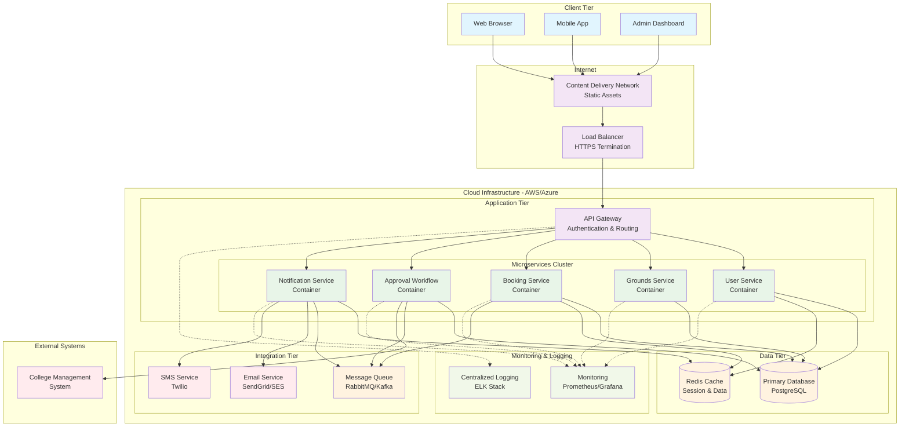

# Physical Architecture Diagrams - 1-Stop Book Project

## 9. Physical Architecture & Design

Describe the architecturally significant components (or elements) of the solution by describing the physical design which may include the network, technologies, nodes and machines where the components are deployed using physical detail deployment and other diagram as necessary. This is where you can also include and describe the cloud services that you use if any.

The physical architecture of the 1-Stop Book solution is designed to provide a scalable, highly available, and secure deployment infrastructure that supports the microservices-based logical architecture. The solution is deployed on Amazon Web Services (AWS) cloud platform, leveraging managed services to reduce operational overhead while ensuring enterprise-grade reliability and performance.

### Physical Architecture Overview

The physical deployment adopts a multi-tier, multi-availability zone architecture that separates concerns across presentation, application, data, and integration tiers. This approach ensures fault tolerance, enables independent scaling of components, and provides clear security boundaries. The architecture leverages containerization with AWS ECS Fargate for compute resources, managed databases for persistence, and a comprehensive suite of AWS services for networking, security, and operational management.

### Cloud Services Architecture

The solution utilizes the following key AWS services:

**Compute Services:**
- **AWS ECS Fargate**: Serverless container platform hosting all microservices
- **AWS Lambda**: Event-driven compute for background processing and integrations
- **AWS API Gateway**: Managed API service providing centralized request routing and security

**Storage and Database Services:**
- **Amazon RDS PostgreSQL**: Managed relational database with multi-AZ deployment
- **Amazon ElastiCache Redis**: In-memory caching for session management and performance optimization
- **Amazon S3**: Object storage for static assets, file uploads, and backup storage

**Networking and Content Delivery:**
- **Amazon CloudFront**: Global content delivery network for static asset distribution
- **Application Load Balancer (ALB)**: Layer 7 load balancing with SSL termination
- **Amazon VPC**: Isolated network environment with public and private subnets

**Integration and Messaging:**
- **Amazon SQS**: Message queuing for asynchronous inter-service communication
- **Amazon EventBridge**: Event-driven integration for system-wide event coordination
- **Amazon SES**: Managed email service for notifications

**Security and Monitoring:**
- **AWS WAF**: Web application firewall for protection against common attacks
- **AWS Secrets Manager**: Centralized secret management for credentials and API keys
- **Amazon CloudWatch**: Comprehensive monitoring, logging, and alerting
- **AWS IAM**: Identity and access management with fine-grained permissions

## High-Level Physical Architecture Diagram



## Low-Level Physical Architecture Diagram

```mermaid
flowchart TB
    %% AWS Region and VPC Structure
    subgraph AWS_REGION ["🌎 AWS REGION: US-EAST-1 (N. Virginia)"]
        direction TB
        
        subgraph VPC_MAIN ["🏗️ VPC: 1-Stop-Book-Production (10.0.0.0/16)"]
            direction TB
            
            %% Internet Gateway and Route 53
            subgraph INTERNET_SERVICES ["🌐 INTERNET SERVICES"]
                direction LR
                IGW["🔗 Internet Gateway<br/>IGW-1stopbook<br/>VPC Attachment"]
                ROUTE53["🔗 Route 53<br/>Domain: 1stopbook.com<br/>Hosted Zone ID: Z123456<br/>TTL: 300s"]
                CF_DIST["📡 CloudFront Distribution<br/>ID: E123456789ABCDEF<br/>Domain: cdn.1stopbook.com<br/>Origins: ALB + S3<br/>Cache Behaviors: 10"]
            end
            
            %% Availability Zone 1 - Complete Infrastructure
            subgraph AZ1 ["📍 AVAILABILITY ZONE 1: us-east-1a"]
                direction TB
        
        subgraph "Availability Zone 2"
            subgraph "Public Subnet 2"
                ALB2[Application Load Balancer<br/>Instance 2<br/>IP: 10.0.4.10]
                NAT2[NAT Gateway<br/>IP: 10.0.4.20]
            end
            
            subgraph "Private Subnet 2 - Application"
                ECS2[ECS Fargate Cluster 2<br/>IP Range: 10.0.5.0/24]
                
                subgraph "Microservices - AZ2"
                    US2[User Service<br/>Container: 10.0.5.10<br/>CPU: 0.5 vCPU, RAM: 1GB<br/>Port: 3001]
                    GS2[Grounds Service<br/>Container: 10.0.5.11<br/>CPU: 0.5 vCPU, RAM: 1GB<br/>Port: 3002]
                    BS2[Booking Service<br/>Container: 10.0.5.12<br/>CPU: 1 vCPU, RAM: 2GB<br/>Port: 3003]
                end
            end
            
            subgraph "Private Subnet 2 - Data"
                RDS2[(RDS PostgreSQL Replica<br/>Instance: db.t3.medium<br/>IP: 10.0.6.10<br/>Port: 5432<br/>Read-only)]
                REDIS2[(ElastiCache Redis<br/>Node: cache.t3.micro<br/>IP: 10.0.6.20<br/>Port: 6379)]
            end
        end
        
        subgraph "Shared Services Subnet"
            APIGW[API Gateway<br/>AWS API Gateway Service<br/>Custom Domain: api.1stopbook.com<br/>SSL Certificate]
            
            SQS[Amazon SQS<br/>Message Queues<br/>- booking-events<br/>- notification-queue<br/>- approval-queue]
            
            S3[Amazon S3<br/>Static Assets<br/>- Images: /images/<br/>- Documents: /docs/<br/>- Backups: /backups/]
            
            CF[CloudFront CDN<br/>Distribution ID: E123456789<br/>Domain: cdn.1stopbook.com<br/>Origin: S3 + ALB]
        end
    end
    
    subgraph "External Services"
        SES[Amazon SES<br/>Email Service<br/>Domain: mail.1stopbook.com<br/>Rate: 200 emails/day]
        
        TWILIO[Twilio SMS<br/>Phone: +1-xxx-xxx-xxxx<br/>Rate: 1000 SMS/month]
        
        ROUTE53[Route 53 DNS<br/>Domain: 1stopbook.com<br/>A Record: ALB<br/>CNAME: www → ALB]
    end
    
    subgraph "Monitoring & Security"
        CW[CloudWatch<br/>Logs & Metrics<br/>Retention: 30 days<br/>Alarms: 15]
        
        WAF[AWS WAF<br/>Web Application Firewall<br/>Rules: OWASP Top 10<br/>Rate Limiting: 1000/min]
        
        SECRETS[AWS Secrets Manager<br/>- DB Credentials<br/>- API Keys<br/>- JWT Secrets]
        
        IAM[AWS IAM<br/>Roles & Policies<br/>- ECS Task Roles<br/>- Lambda Execution Roles]
    end

    %% Network Connections
    CF --> ALB1
    CF --> ALB2
    ALB1 --> ECS1
    ALB2 --> ECS2
    
    %% Service Connections within AZ1
    US1 --> RDS1
    GS1 --> RDS1
    BS1 --> RDS1
    US1 --> REDIS1
    BS1 --> REDIS1
    
    %% Service Connections within AZ2
    US2 --> RDS2
    GS2 --> RDS2
    BS2 --> RDS2
    US2 --> REDIS2
    BS2 --> REDIS2
    
    %% Cross-AZ Database Replication
    RDS1 -.->|Async Replication| RDS2
    
    %% API Gateway Connections
    APIGW --> ALB1
    APIGW --> ALB2
    
    %% Message Queue Connections
    BS1 --> SQS
    BS2 --> SQS
    
    %% External Service Connections
    US1 --> SES
    US2 --> SES
    US1 --> TWILIO
    US2 --> TWILIO
    
    %% Security & Monitoring
    WAF --> ALB1
    WAF --> ALB2
    ECS1 -.-> CW
    ECS2 -.-> CW
    RDS1 -.-> CW
    RDS2 -.-> CW
    
    %% DNS
    ROUTE53 --> CF

    %% Styling
    classDef aws fill:#ff9900,color:#000
    classDef database fill:#4fc3f7
    classDef container fill:#81c784
    classDef external fill:#ef5350
    classDef security fill:#ba68c8
    classDef network fill:#ffb74d
    
    class ECS1,ECS2,APIGW,SQS,S3,CF,CW,WAF,SECRETS,IAM,SES,ROUTE53 aws
    class RDS1,RDS2,REDIS1,REDIS2 database
    class US1,GS1,BS1,US2,GS2,BS2 container
    class TWILIO external
    class WAF,SECRETS,IAM security
    class ALB1,ALB2,NAT1,NAT2 network
```

### Physical Architecture Key Decisions

Provide a summary of the significant decisions made in arriving at the architecture of the solution that are related and/or reflected in the physical view. Documented decisions should focus on trade-off choices and rationale. You should continue the numbering from the previous architectural decisions table.

The key architectural decisions taken are as follows:

| Identifier | Description |
|------------|-------------|
| **AD-03** | **Cloud-Native AWS Deployment**: The solution is deployed entirely on AWS cloud infrastructure using managed services rather than on-premises or hybrid deployment. **Rationale**: This supports the drivers of Scalability and Maintainability by leveraging AWS's elastic infrastructure and managed services, reducing operational overhead. AWS provides built-in high availability, disaster recovery, and security features that would be costly and complex to implement on-premises. **Trade-off**: Introduces cloud vendor lock-in and ongoing operational costs, but eliminates capital expenditure and reduces infrastructure management complexity. |
| **AD-04** | **Containerized Deployment with ECS Fargate**: All microservices are deployed as containers using AWS ECS Fargate rather than EC2 instances or Lambda functions. **Rationale**: Containers provide consistent deployment environments and resource isolation while Fargate eliminates server management overhead. This supports Maintainability and Scalability by enabling independent service deployment and scaling. **Trade-off**: Higher cost compared to EC2 instances but eliminates infrastructure management and provides better resource utilization than traditional VMs. |
| **AD-05** | **Multi-Availability Zone Architecture**: The infrastructure is deployed across multiple AWS Availability Zones with active-active configuration. **Rationale**: This directly supports the Availability driver by ensuring the system remains operational even if one AZ experiences failure. Database replication and load balancing across AZs provide fault tolerance. **Trade-off**: Increased complexity in deployment and potential cross-AZ data transfer costs, but essential for meeting 99.9% uptime requirements. |
| **AD-06** | **Managed Database Services (RDS PostgreSQL)**: The solution uses Amazon RDS PostgreSQL rather than self-managed database instances. **Rationale**: RDS provides automated backups, security patches, high availability, and performance monitoring, supporting both Security and Maintainability drivers. Multi-AZ deployment ensures database availability. **Trade-off**: Higher cost than self-managed databases and less control over database configuration, but significantly reduces operational overhead and improves reliability. |
| **AD-07** | **API Gateway Pattern with AWS API Gateway**: All external requests are routed through AWS API Gateway rather than direct load balancer access to services. **Rationale**: Centralizes cross-cutting concerns like authentication, throttling, request/response transformation, and API versioning. This supports Security by providing a single point of policy enforcement and Scalability through built-in caching and throttling. **Trade-off**: Introduces additional latency (typically 50-100ms) and cost per request, but provides essential enterprise features and reduces service complexity. |
| **AD-08** | **Event-Driven Architecture with SQS**: Asynchronous communication between services uses Amazon SQS message queues rather than direct HTTP calls or database polling. **Rationale**: This supports Scalability and Maintainability by enabling loose coupling between services and handling traffic spikes through message buffering. Failed messages are automatically retried and moved to dead letter queues for investigation. **Trade-off**: Increased architectural complexity and eventual consistency challenges, but essential for building resilient distributed systems. |

## Physical Architecture Components Details

### Physical Deployment Architecture

The physical deployment of the 1-Stop Book application follows a distributed, cloud-native architecture pattern that separates the system into distinct tiers, each optimized for its specific role. The deployment leverages AWS's global infrastructure to provide low-latency access and high availability.

#### **Network Topology and Infrastructure**

The network architecture implements a secure, multi-tier approach using Amazon Virtual Private Cloud (VPC) with the following topology:

**VPC Configuration:**
- **CIDR Block**: 10.0.0.0/16 providing 65,536 IP addresses
- **Availability Zones**: Deployed across 2 AZs (us-east-1a, us-east-1b) for fault tolerance
- **Internet Gateway**: Provides controlled internet access for public subnets
- **NAT Gateways**: Enable outbound internet connectivity for private subnet resources

**Subnet Architecture:**
- **Public Subnets (2)**: 10.0.1.0/24, 10.0.4.0/24 - Host load balancers and NAT gateways
- **Private Application Subnets (2)**: 10.0.2.0/24, 10.0.5.0/24 - Host ECS containers and application logic
- **Private Data Subnets (2)**: 10.0.3.0/24, 10.0.6.0/24 - Host databases and caching services

#### **Compute Infrastructure Nodes**

**Container Orchestration Platform:**
The application services are deployed on AWS ECS Fargate, a serverless container platform that eliminates the need to manage EC2 instances while providing fine-grained resource allocation:

- **Service Mesh**: Each microservice runs as an independent ECS service with auto-discovery
- **Resource Allocation**: Services allocated between 0.25-2 vCPU and 0.5-4GB RAM based on workload requirements
- **Horizontal Scaling**: Auto-scaling groups configured with target tracking policies
- **Service Registry**: AWS Cloud Map provides service discovery for inter-service communication

**Load Balancing Infrastructure:**
- **Application Load Balancer (ALB)**: Layer 7 load balancer with path-based routing
  - **Target Groups**: Separate target groups for each microservice with health checks
  - **SSL Termination**: AWS Certificate Manager handles SSL/TLS certificates
  - **Geographic Distribution**: Multiple ALB instances across availability zones

**API Gateway Architecture:**
- **AWS API Gateway**: Centralized entry point for all client requests
  - **Custom Domain**: api.1stopbook.com with Route 53 DNS management
  - **Request Throttling**: 1000 requests per second per API key with burst capacity
  - **Caching**: Response caching enabled for GET requests with TTL of 300 seconds

### Infrastructure Specifications

#### **Compute Resources**

- **Container Platform**: AWS ECS Fargate
- **API Gateway**: AWS API Gateway with custom domain
- **Load Balancing**: Application Load Balancer (ALB) with SSL termination
- **Auto Scaling**: Target tracking based on CPU (70%) and memory (80%) utilization

#### **Database Configuration**
- **Primary Database**: Amazon RDS PostgreSQL 14
  - Instance Type: db.t3.medium (2 vCPU, 4 GB RAM)
  - Storage: 100 GB General Purpose SSD with auto-scaling up to 1TB
  - Multi-AZ deployment for high availability
  - Automated backups with 7-day retention
  
- **Caching Layer**: Amazon ElastiCache Redis
  - Node Type: cache.t3.micro (1 vCPU, 0.5 GB RAM)
  - Cluster mode disabled
  - Backup enabled with 5-day retention

#### **Networking Architecture**
- **VPC**: 10.0.0.0/16 CIDR block
- **Availability Zones**: 2 AZs for high availability
- **Subnets**:
  - Public Subnets: 10.0.1.0/24, 10.0.4.0/24 (ALB, NAT Gateway)
  - Private App Subnets: 10.0.2.0/24, 10.0.5.0/24 (ECS containers)
  - Private Data Subnets: 10.0.3.0/24, 10.0.6.0/24 (RDS, Redis)

#### **Security Configuration**
- **WAF**: AWS Web Application Firewall with OWASP Top 10 protection
- **SSL/TLS**: AWS Certificate Manager for SSL certificates
- **Secrets Management**: AWS Secrets Manager for sensitive data
- **Network Security**: Security Groups with principle of least privilege
- **IAM**: Role-based access control for all AWS resources

### Service Deployment Specifications

| Service | Container Specs | Port | Health Check | Scaling Policy |
|---------|----------------|------|--------------|----------------|
| User Service | 0.5 vCPU, 1GB RAM | 3001 | /health | Min: 2, Max: 10 |
| Grounds Service | 0.5 vCPU, 1GB RAM | 3002 | /health | Min: 2, Max: 8 |
| Booking Service | 1 vCPU, 2GB RAM | 3003 | /health | Min: 2, Max: 15 |
| Approval Workflow | 0.5 vCPU, 1GB RAM | 3004 | /health | Min: 1, Max: 5 |
| Notification Service | 0.5 vCPU, 1GB RAM | 3005 | /health | Min: 2, Max: 8 |

### Data Flow and Communication Patterns

#### **Synchronous Communication**
- Client → CloudFront → ALB → API Gateway → Microservices
- Inter-service communication via service discovery (AWS Cloud Map)
- Database connections through connection pooling

#### **Asynchronous Communication**
- Event-driven messaging via Amazon SQS
- Dead letter queues for failed message handling
- Message ordering for critical workflows

#### **Monitoring and Observability**
- **Application Metrics**: CloudWatch custom metrics
- **Infrastructure Metrics**: CloudWatch container insights
- **Distributed Tracing**: AWS X-Ray integration
- **Log Aggregation**: CloudWatch Logs with structured logging
- **Alerting**: CloudWatch Alarms with SNS notifications

### Disaster Recovery and Backup Strategy

#### **Recovery Time Objectives (RTO) / Recovery Point Objectives (RPO)**
- **RTO**: 4 hours maximum downtime
- **RPO**: 1 hour maximum data loss

#### **Backup Strategy**
- **Database**: Automated daily backups with 7-day retention
- **Application State**: Stateless containers enable quick recovery
- **File Storage**: S3 cross-region replication for critical assets
- **Configuration**: Infrastructure as Code (CloudFormation/CDK)

#### **Multi-AZ Deployment**
- Active-Active configuration across two availability zones
- Automatic failover for database and cache layers
- Health checks and circuit breakers for service resilience

### Capacity Planning

#### **Current Capacity (Phase 1)**
- **Expected Users**: 1,000 concurrent users
- **Peak Load**: 500 requests/second
- **Storage**: 50GB initial database size
- **Network**: 1Gbps aggregate bandwidth

#### **Scaling Projections (Phase 2-3)**
- **Expected Users**: 10,000 concurrent users
- **Peak Load**: 5,000 requests/second
- **Storage**: 500GB database with read replicas
- **Network**: 10Gbps aggregate bandwidth

### Cost Optimization

#### **Resource Optimization**
- **Spot Instances**: For non-critical batch processing
- **Reserved Instances**: For predictable workloads (database)
- **Auto Scaling**: Automatic scale-down during low usage periods
- **S3 Lifecycle**: Automatic archival of old data to cheaper storage tiers

#### **Estimated Monthly Costs (Phase 1)**
- **Compute (ECS Fargate)**: $200-400
- **Database (RDS)**: $150-250  
- **Storage (S3, EBS)**: $50-100
- **Network (CloudFront, ALB)**: $100-200
- **Monitoring & Security**: $50-100
- **Total Estimated**: $550-1,050/month

This physical architecture provides a scalable, secure, and highly available foundation for the 1-Stop Book application, supporting the initial college ground booking functionality with the capability to expand to additional services and institutions.